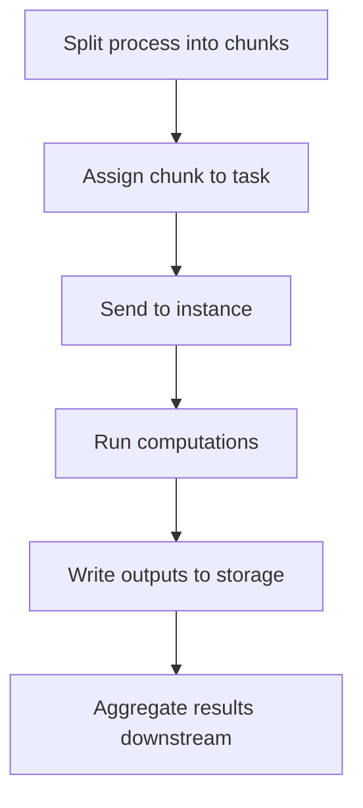

# High performance computing

Large scale computing with cloud services for parallel processing
Focusing on spatial data 

Compared to serial processing, which can be accomplished with a for loop, parallel processing splits up a task into discrete “chunks” to be processed simultaneously. For example, if working with gridded spatial data, each cell can be processed as a “chunk”

## Process

## Tools
* Local dev - GitHub for version control
* Access - SSH, terminal protocol, so you can securely connect
* Runtime - ECs, tmux - allows us to monitor
* Package management - (R, pip, virtual environment)
* Parallelization - Python  already has base libraries for multi-processing

