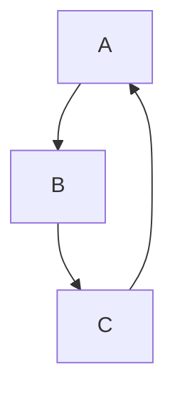
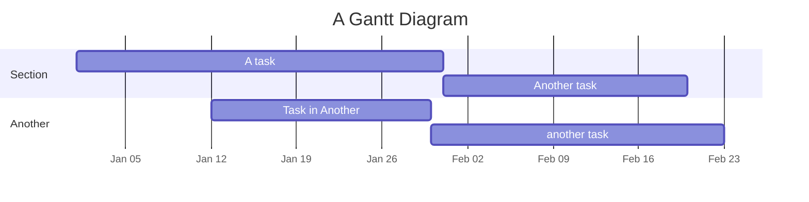

# Workflow Visualization

Workflow visualization is a useful tool for project management. It can organize the steps in a process, illustrate dependencies between tasks, and display timelines.

It can help to start your visualization using pen and paper. You can also use PowerPoint, Word, and there are a variety of other tools you can use as well.

## Best Practices

* Keep your workflow simple and clear by using easy to understand labels, symbols, and colors.
* Update your workflow as you go to reflect changes to roles, processes, and priorities.


## Types and Examples of Workflow Visualization

If you're working in markdown, the Mermaid extension for VSCode allows users to attach diagrams into code scripts, allows users to quickly update diagrams as needed, provides two links associated with each diagram: one link opens up the diagram in a new tab, the other link allows the user to edit the diagram in Mermaid Chart.


### Flowcharts

Flowcharts are visualizations where nodes or shapes represent tasks, and the connections between nodes represent dependencies.

In a *.md file, you can build a flowchart that looks like this:

By writing the following code:
````

````

### Gantt Chart

Gantt charts are a tool to help visualize the progression of projects
* Project progression
* Scheduling
* Dependencies

Gantt charts are primarily used to help organize large teams and provide a visual overview of project progress across the team.

You can also use Mermaid for Gantt charts!



Here's the code that built it:
````

````
Check out the [Mermaid documentation](https://docs.mermaidchart.com/mermaid-oss/intro/syntax-reference.html) for more features and syntax

## Other tools and software

In addition to Mermaid, there are tons of other tools and software you can use to create workflow visualizations. Some examples below.

[Microsoft Visio](https://www.microsoft.com/en-us/microsoft-365/visio)

[Mermaid Chart](https://www.mermaidchart.com/)

[Lucidchart](https://www.lucidchart.com/pages)

[Zapier Canvas](https://zapier.com/canvas)

[Canva](https://www.canva.com/)

[Miro](https://miro.com/)

[Hive](https://hive.com/)