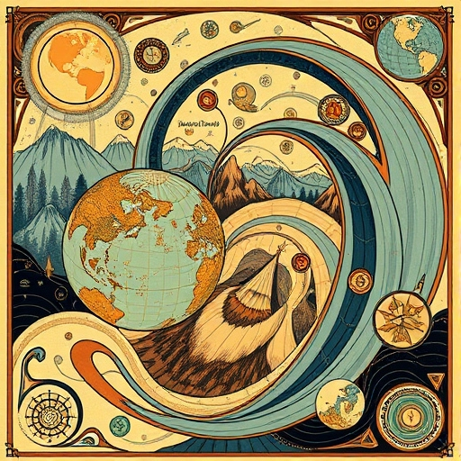

# Analytical Workflows for Earth Systems Science

Welcome to the course webpage for GEOG 463/563 at Oregon State University! This repository will contain all resources for the course.

## Communication
[Prof. James Watson](https://jrwatson.ceoas.oregonstate.edu/people/) will be your instructor. That's me. Communicate with me in class, or email me at james.watson@oregonstate.edu.

## Course Description
This course explores data science methods used to gather, validate, organize, analyze, and summarize large amounts of environmental and ecological information. Focuses on developing analytical workflows that are efficient, reproducible, and modular using scientific coding languages, and version control and collaborative coding environments. Examines case studies including climate change, biodiversity assessments, epidemic modeling, marine spatial planning, and natural resource management.

## Learning Outcomes
Upon completion of this course, students will be able to:

1) Design and conduct a research project involving the analysis of  environmental data
2) Apply best practices in data collection, cleaning, wrangling, analysis, and visualization
3) Read and write scientific code 
4) Implement best practices in scientific programming to promote reproducible research
5) Manage collaborative research projects using a version control system

In addition, graduate students will be able to:

6) Select and cite relevant research articles
7) Synthesize their findings into a broader environmental context

## How each week works
This is a flipped course where students will learn by doing. The two main learning mechanisms are 1) weekly github repo development and 2) a term project (that can be done in teams).

### Weekly Github Development
Every week, students will work in teams to create Github repos for various topics. The instructor will provide instruction for the challenge of the week. Then, students will work on the weekly assignment in class. The weekly assignments are focused on gaining experience working with **Github**, through collaborative coding/writing and version control. Specifically, each week

1) The instructor will provide a short primer (~10mins) on the week's challenge. Weekly challenges will focus on developing Github README.md pages for different topics of relevance to analytical workflows
2) Students will then break into groups and start working on the challenges in class time. This will involve Forking the class repo and working collaboratively. 
3) At the end of the week, students will merge their contributions to the class repo
2) The following week, students will conduct peer-review on each other's repo's, and provide feedback. Students then have an opportunity to make updates before submitting their repo as an assignment in Canvas.

### Term-Project
The term project is the main focus on the course. Students will work on their term project in small groups, and there will be assignments periodically through the term on their projects. The project assignments are:

- 1-page project pitch (Week 3)
- Mid-term 10 min presentation (Week 5)
- End-term 15 min presentation (Week 10)
- Project report (by end of Finals)

In addition, every Monday and Thursday, the instructor will hold "open" and "close" meetings: this will involve students detailing what they will individually work on in the week, and what they have done respectively. This will be documented on this google doc:

https://docs.google.com/document/d/16Rht2inZYq5yl8y89sqppsBJeLIvgdFAI-DV6jqCMfE/edit?usp=sharing

## The Course at a Glance
- Week 1: 
    - Introduction to the course, learning how to learn, getting to know each other 
    - Starting term projects 
    - Review these Repos: 1) Weekly assignments, 2) Github version control, 3) Peer-review 
- Week 2: 
    - Weekly challenge topic 1: Terminal_IDEs_Shell 
    - Weekly challenge topic 2: Scientific_coding_in_R 
    - Project focus: the 1-page pitch, project management
- Week 3: 
    - Weekly challenge topic 1: Exploratory_data_analysis
    - Weekly challenge topic 1: Typesetting (Markdown and Latex)
    - Project focus: getting data
- Week 4: 
    - Weekly challenge topic 1: Plotting using code
    - Weekly challenge topic 2: LLMs
    - Project focus: making good short presentation
- Week 5: 
    - Project assignment 10 minute presentation
    - Independent work on projects

- Week 6: 
    - Weekly challenge topic 1: Workflow_visualization
    - Weekly challenge topic 2: Writing collaboratively
    - Project focus: project reporting
- Week 7: 
    - Weekly challenge topic 1: High performance computing
    - Weekly challenge topic 2: Google_earth_engine
- Week 8: Machine Learning I
    - Dr. Jack Buckner to give lectures on Machine Learning that will blow your mind
- Week 9:
    - Independent work on projects 
- Week 10: 
    - End-term project reporting and presentations

## Schedule
| **Week** | **Mon Lecture** | **Wed Lecture** | **Thu Lab** | **Lead Instructor** | **Project Milestones**          |
|----------|-----------------|-----------------|-------------|---------------------|------------------------------------|
| **1**| X      | 24-Sep  | X      | James  | NA |
| **2**| 29-Sep | 1-Oct   | 2-Oct  | James  | NA    |
| **3**| 6-Oct  | 8-Oct   | 9-Oct  | James  | 1-page project pitch    |
| **4**| 13-Oct | 15-Oct  | 16-Oct | James  | NA    |
| **5**| 20-Oct | 22-Oct  | 23-Oct | James  | Mid-term presentation    | 
| **6**| 27-Oct | 29-Oct  | 30-Oct | James  | NA    |
| **7**| 3-Nov  | 5-Nov   | 6-Nov  | James  | NA    |
| **8**| 10-Nov | 12-Nov  | 13-Nov | Jack   | NA    |
| **9**| 17-Nov | 19-Nov  | 20-Nov | Jack   | NA    |
|**10**| 24-Nov | 26-Nov  | 27-Nov | James  | End-term presentation  |
|**11**| X      | X       | X      | James  | Report  |

### Notes
- No finals (go do some research and publish a paper instead)
- X means no class

